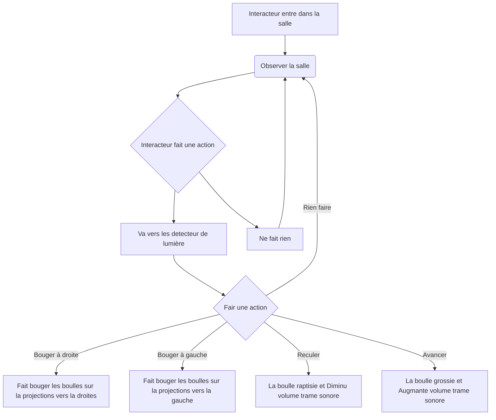
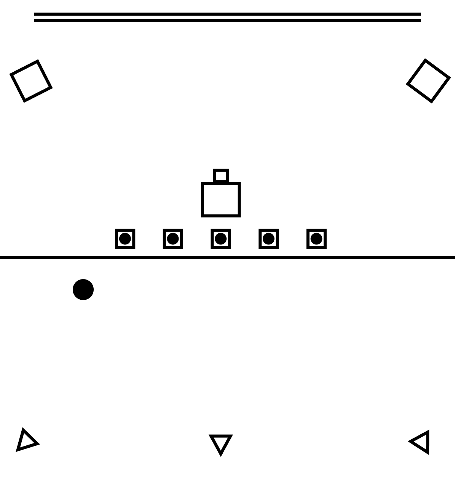

# Projet : Impulsum

## Idée

### Concept

Installation qui utilise des détecteurs de lumière pour détecter l'ombre de l'interacteur pour effectuer une projection circulaire.

### Objectifs

Créé un lien entre l'interacteur, la musique et le visuel.

Voir l'impact de la musique visuellement.

### Motivations

* Une bonne compréension de touchDesigner
* Permet un element d'intercativiter simple

## Scénario

## Ambiance

### Planche d'ambiances visuelles (moodboard)

### Planche d'ambiances sonores

### Références artistiques (image de reference)

## Technologies

### Support médiatique

### Matériel

#### Schéma

Le point est l'interacteur.

* Projecteur

* Lumières (x3)

* Detecteur de lumière

* Speakers (x2)

* Mur

* Cables (extensions, cables pour detecteur de lumière et cables pour lumièr)

* Portable ou ordinateur avec touchDesigner

* Écran, souris et clavier

### Logiciels

* TouchDesigner

* OSCBridge (pour le moment)

* Programme Arduino

### Réseautage

Communication faite entre un portable ou un ordinateur avec un périphérique qui a un programme Arduino qui permet la communication avec TouchDesigner avec OSC.
Câble USB ou Ethernet à déterminer.

