# Projet : Sellae Lucidae

## Concept

Installation qui utilise une Kinect pour détecter la position de l'interacteur pour effectuer une projection. La projection consiste de plusieurs étoiles alignées les unes à côté des autres, ayant chacune une section assignée où les interacteurs peuvent interagir avec l'étoile dans leurs sections.

### Objectifs

Émerveiller l'interacteur en créant un lien entre l'interacteur et le visuel. Permettre de voir la grandeur des astres qui entourent la terre.

[Définition des objectifs de l'expérience : quel est le message ou l'émotion que l’on souhaite faire passer ?]: #

### Motivations

[Discussion des motivations créatives derrière le choix des médias et des technologies.]: #

* Les étoiles (objets peu connus est donc un sujet intéressant à explorer)
* Une bonne compréhension de TouchDesigner

### Références et inspirations

#### Planche d'ambiances visuelles (moodboard)

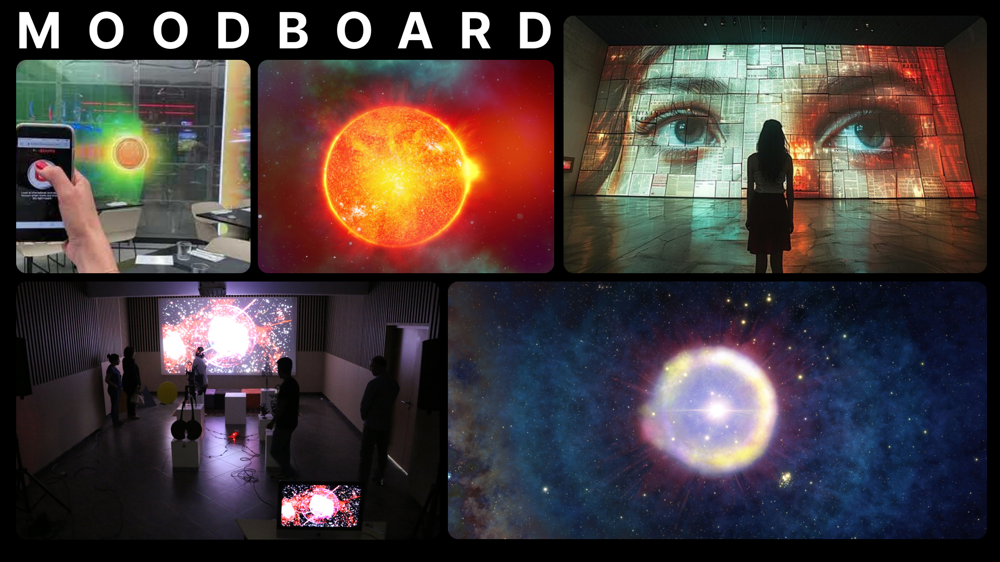

Prototype que j'ai fait.

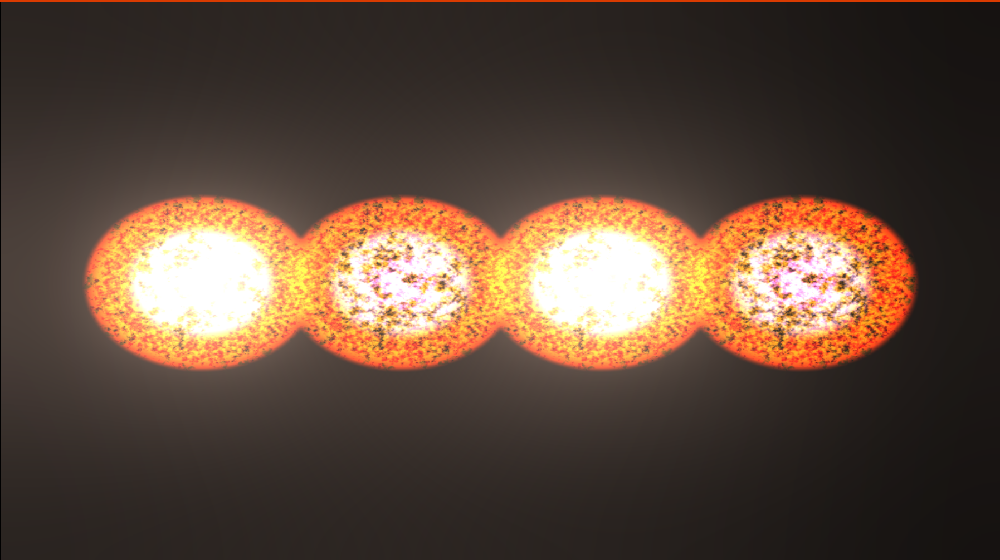

### Planche d'ambiances sonores

[Vidéo Youtube son d'étoile (les crédits des sons son dans la description de la vidéo)](https://www.youtube.com/watch?v=UoIm7IS0sgY)

[Utilisation d'échantillons, de musiques, de textures sonores pour représenter l’univers artistique.]: #

## Scénario interactif

### Déroulement interactif

L'utilisateur interagie en bougant devant l'ecran qui a une Kinect en dessous qui perment de detecter l'utiisateur est dans quelle sections. L'utilisateur peut interagire en  bougant ce qui affect des grosses étoiles leur lumière, leur grosseur et leur noise. L'uttilisateur affect aussie les petites étoile dans le background. Le son d'ambiance est constant.

[ - Décrire comment l’utilisateur interagit avec l’installation. - Expliquer les actions possibles, les réponses de l’installation (visuelles, sonores, lumineuses) et les chemins narratifs ou évolutions possibles.]: #

### Logigramme des interactions

[ - Présenter un schéma illustrant les points d’interaction clé, les déclenchements multimédias, et les éventuels embranchements narratifs.]: #

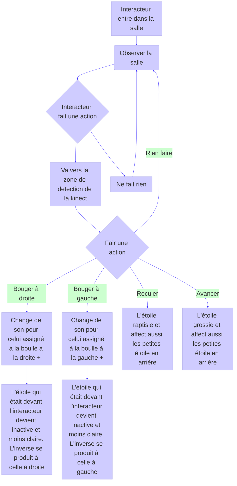

## Scénarimage / Simulation

### Visualisation des séquences

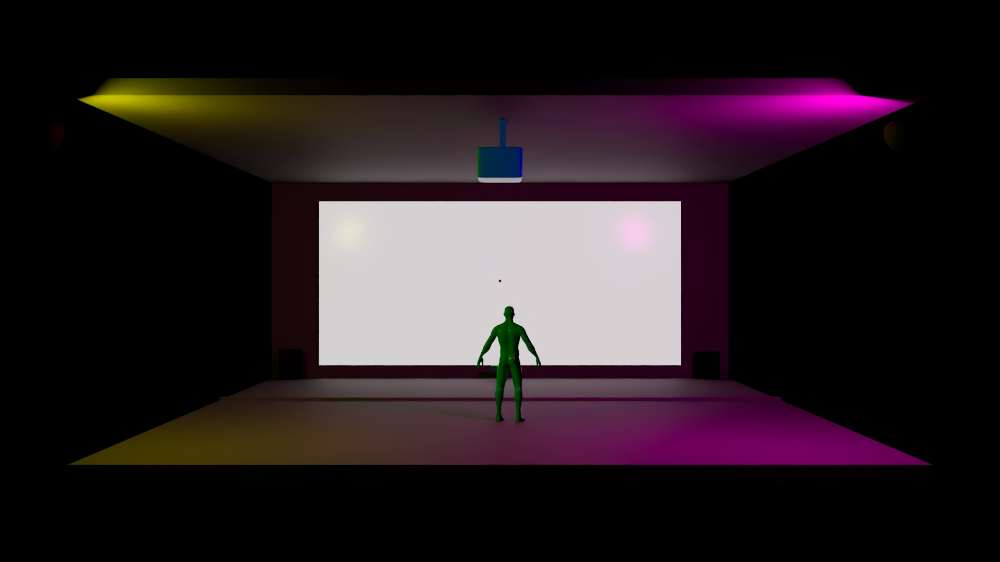

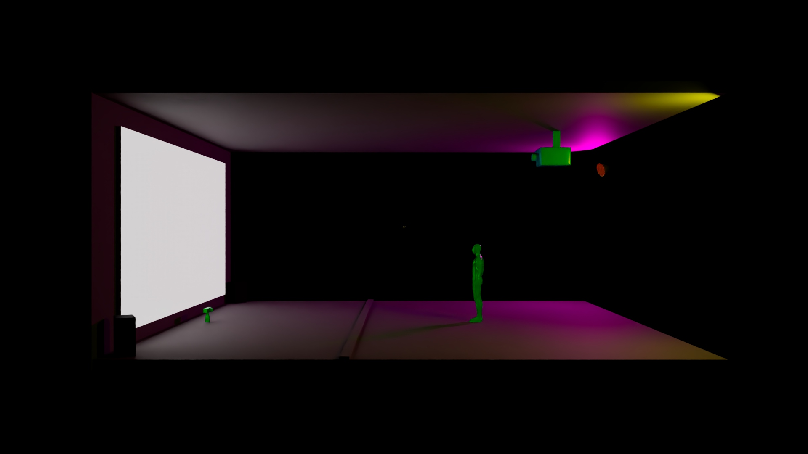

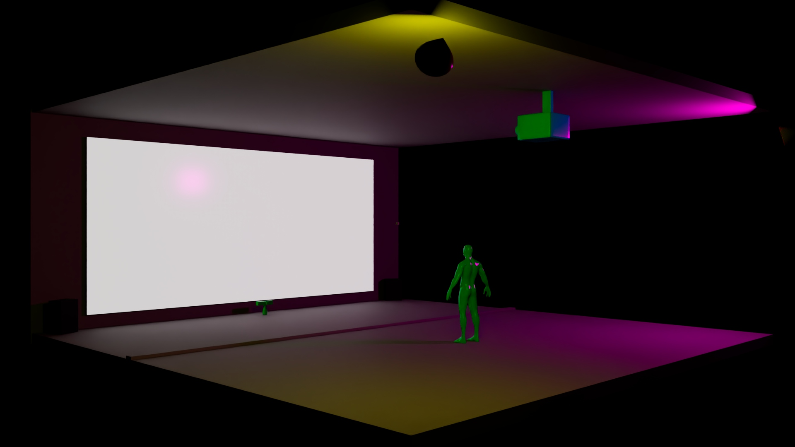

[ - Présenter un scénarimage ou une simulation en 3D qui montre les principales étapes de l’expérience multimédia, du point de vue de l’utilisateur.]: #

### Illustrations des interactions

[ - Intégrer des visuels ou des captures d’écrans montrant comment l’installation réagit aux actions des utilisateurs.]: #

### Évolution visuelle et narrative

[ - Visualiser la progression de l'expérience en fonction des interactions utilisateurs.]: #

## Synoptique

### Schéma technique

[ - Créer un synoptique représentant les connexions entre les dispositifs (câblages, réseaux, signaux audio/vidéo, etc.). - Préciser les types de signal, les protocoles utilisés et la communication entre les dispositifs (OSC, MIDI, DMX, etc.).]: #

### Flux de données

[ - Décrire le cheminement des flux de données entre les différentes composantes de l’installation.]: #

## Plantation

### Emplacement des dispositifs

#### Schéma

Le point est l'interacteur.

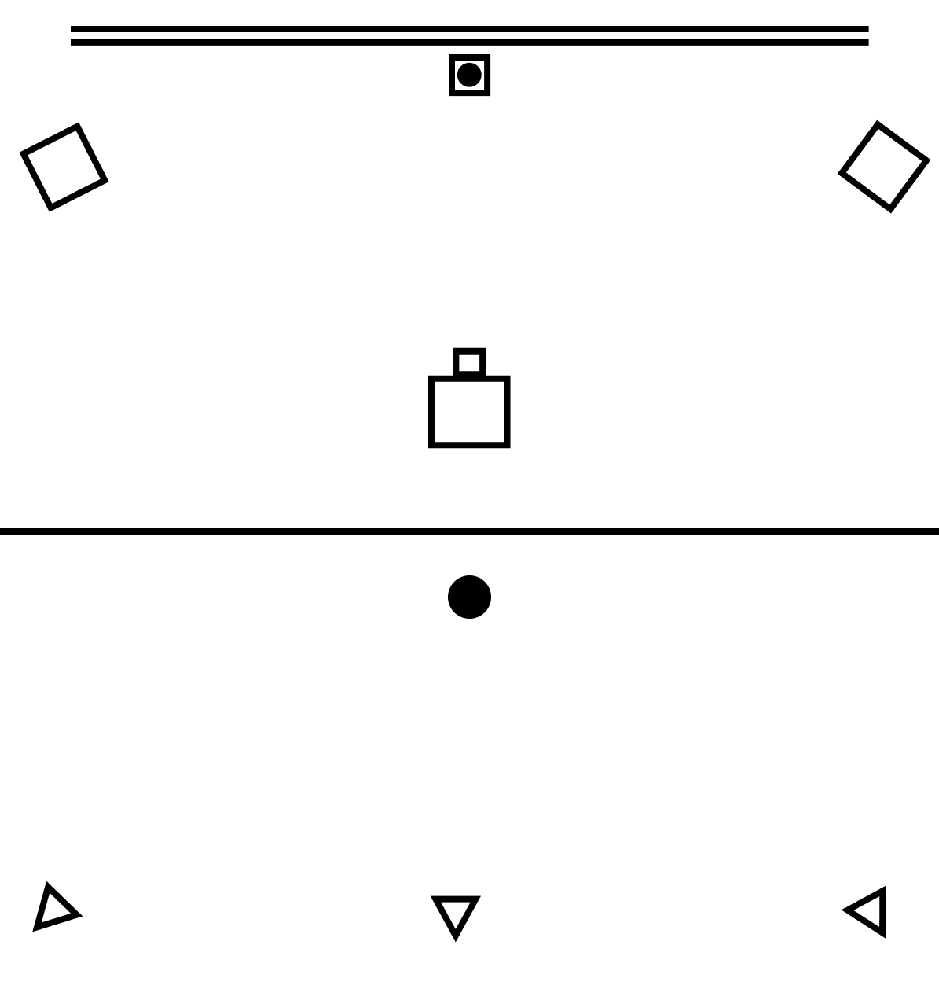

[ - Planifier la disposition des dispositifs multimédias dans l’espace (projecteurs, capteurs, caméras, haut-parleurs, etc.). - Justifier chaque emplacement en fonction des besoins techniques et des interactions utilisateurs..]: #

### Circulation des visiteurs

[ - Anticiper le mouvement des visiteurs et leur interaction avec les points d’interaction dans l’espace.]: #

### Gestion des câblages

[ - Préciser comment les câblages et connexions seront organisés pour assurer la sécurité et l’esthétique de l’installation.]: #

Next ------------------------------------------- tech

## Anticiper les besoins matériels et logiciels

### Liste des équipements

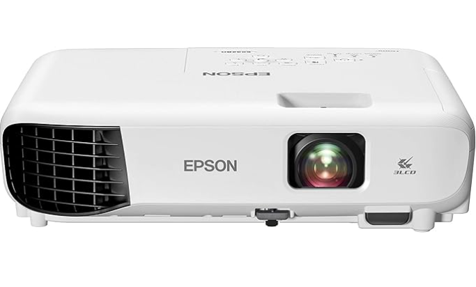
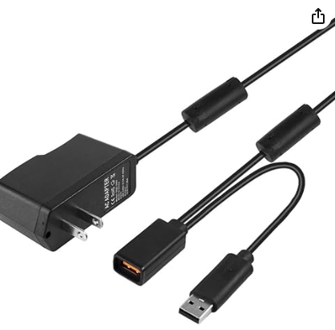
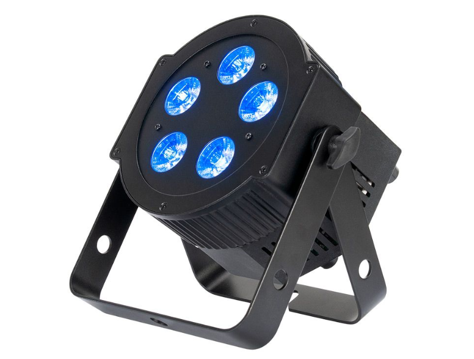
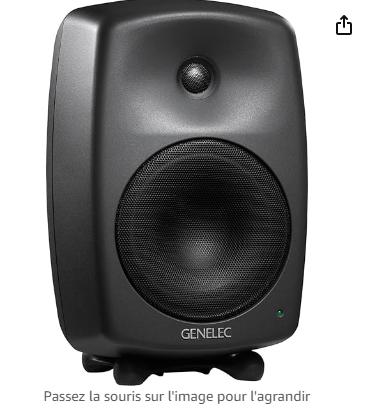
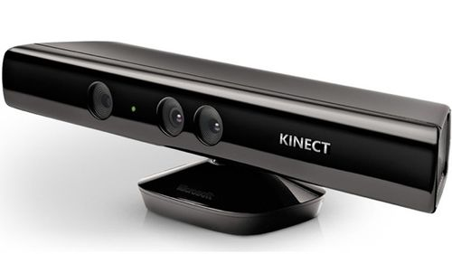

[ - Identifier les équipements nécessaires (projecteurs, serveurs, capteurs, dispositifs interactifs, etc.) et justifier leur choix en fonction des besoins du projet.]: #

### Logiciels et réseaux

[ - Préciser les logiciels et systèmes nécessaires au bon fonctionnement de l’installation (logiciels de projection, de traitement vidéo, gestion d’éclairage, etc.). - Décrire la gestion des réseaux et des systèmes de communication entre les différentes composantes.]: #

## Technologies

### Support médiatique

Utilisation de sons différents pour chaque section où il y aura une boulle dans la projection pour créer une trame sonore complète.
Visuel fait avec TouchDesigner créant des images de boulles chantantes ressemblant à des étoiles.

[Description des types de médias (vidéo, audio, lumières, capteurs, etc.) et de leur intégration pour créer une expérience immersive.]: #

### Matériel

| Projecteur | Lumières (x3) | Kinect | Speakers (x2) | Mur |
| :--------------- |:---------------| :-----| :--------------- |:---------------|
|  |  |   |  |  |

* Cables (extensions, cables pour la kinect, cables pour les lumières)

* Portable ou ordinateur avec touchDesigner

* Écran, souris et clavier

### Logiciels

* TouchDesigner

* QLC+ (pour les lumières)

* Programme pour utiliser la kinect

### Réseautage

Un portable ou un ordinateur avec TouchDesigner communique avec un logiciel qui peut comprendre les données de la Kinect et qui les renvoie à TouchDesigner.
Câble USB ou Ethernet à déterminer.

## Réferences

### Medias

* [Étoile (soleil)](https://www.numerama.com/sciences/642330-cette-etoile-se-deplace-a-8-de-la-vitesse-de-la-lumiere-pourquoi-est-elle-si-rapide.html)
* [Générer par ai trouver sur google](https://www.freepik.com/premium-ai-image/multimedia-installation-exploring-role-design_235406780.htm)
* [Première Étoile](https://www.cieletespace.fr/actualites/les-astronomes-ont-ils-enfin-observe-une-etoile-primordiale)
* [Connection 1](https://blog.connectinstitute.ma/connexion-1-une-installation-multimedia-unique/)
* [Boulle rgb](https://www.youtube.com/watch?app=desktop&v=DKmHAMbtDlg)

**Par Victor Gileau**
