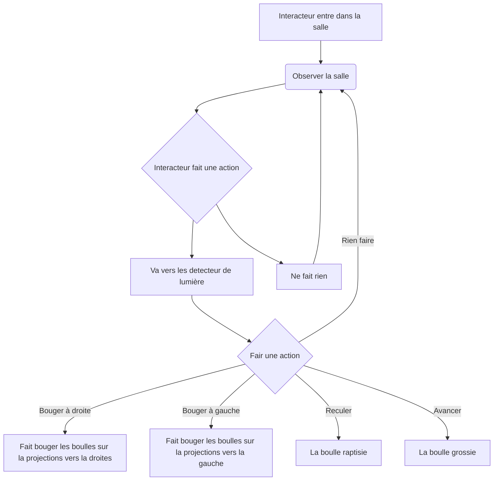

# Projet : Instrumentum

## Idée

### Concept

Installation qui utilise des instruments de musique utiliser par l'interacteur pour affecter une projection circulaire.

### Objectifs

Créé un lien entre l'interacteur, la musique et le visuel.

Voir l'impact de la musique visuellement.

### Motivations

* Une bonne compréension de touchDesigner
* Permet un element d'intercativiter simple

## Scénario

## Ambiance

### Planche d'ambiances visuelles (moodboard)

### Planche d'ambiances sonores

### Références artistiques (image de reference)

## Technologies

### Support médiatique

### Matériel

#### Schéma

Le point est l'interacteur.

* Projecteur

* Lumières (x3)

* Instruments de musiques

* Mur

* Cables (extensions, cables pour detecteur de lumière et cables pour lumièr)

* Portable ou ordinateur avec touchDesigner

* Écran, souris et clavier

* Instrument de musique (x5) 

* Micro sur chaque instrument pour capter les instruments

### Logiciels

* ToucheDesigner

* OSC (pour le moment)

* Programme Arduino
