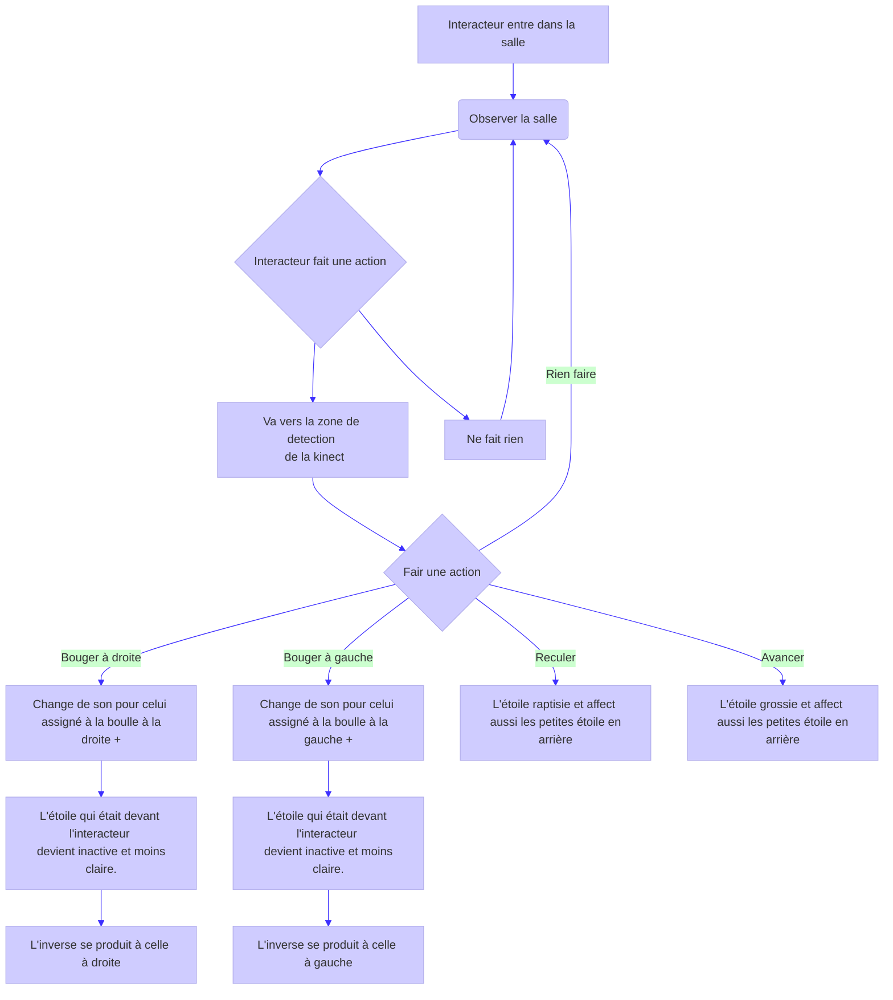
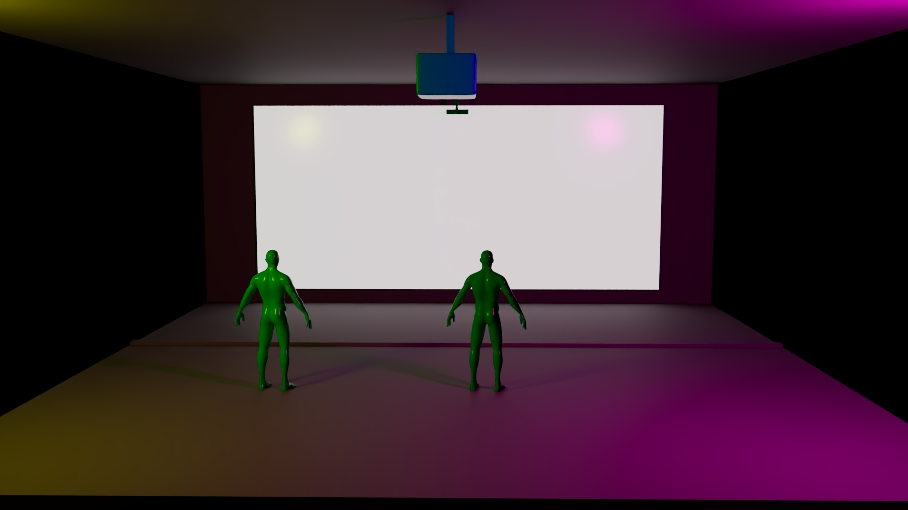
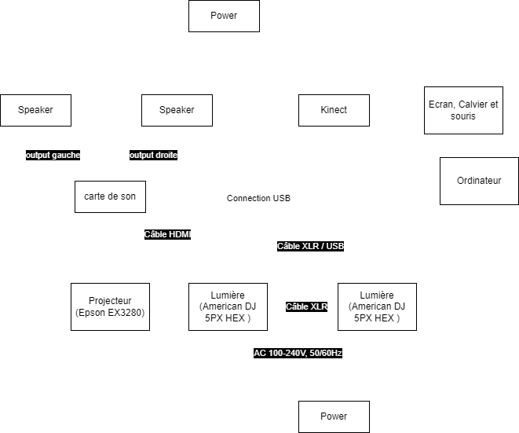
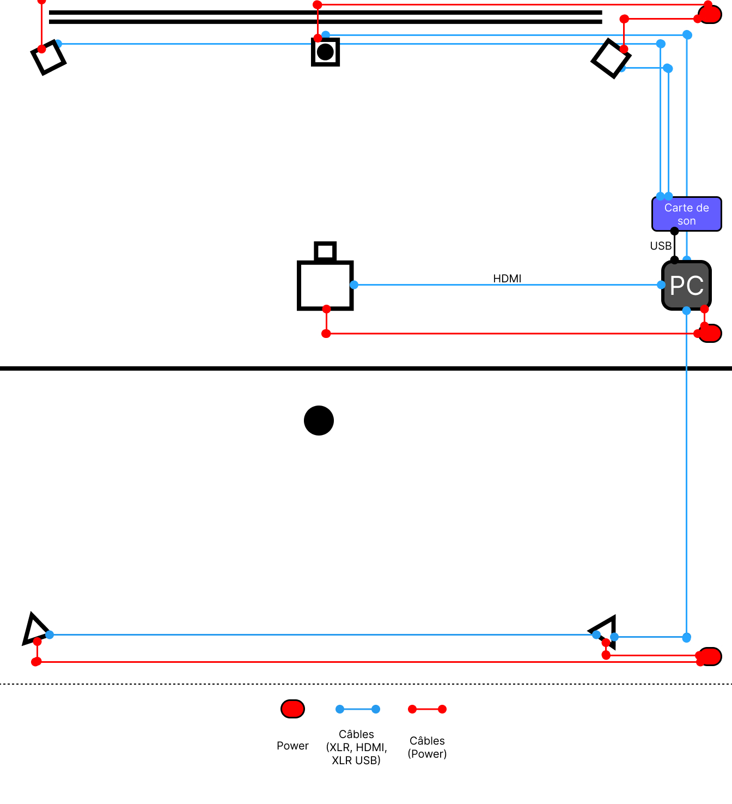
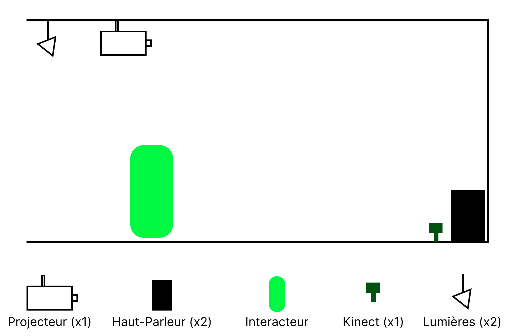
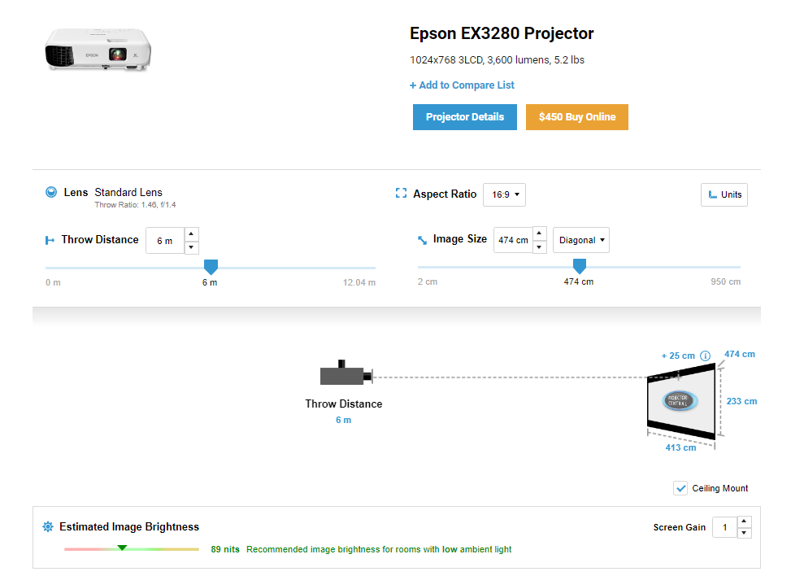

# Projet : Étoile Mouvante

## Concept

**Installation** qui utilise une **Kinect** pour détecter la position de l'interacteur pour effectuer une projection. La projection consiste de plusieurs **étoiles** alignées les unes à côté des autres, ayant chacune une **section** assignée où les **interacteurs** peuvent interagir avec l'étoile dans la section. La section change de **plus en plus** quand l'interacteur fait de mouvement, pour finalement créer une **supernova** qui détruit ses alentours. Cela peut être reproduit sur toutes les **étoiles** qui sont en gros sur la **projection**. L'installation montre l'impact qu'on peut avoir. Pour finalement montrer un **espace vide**.

### Objectifs

Montrer l'**histoire** d'une **étoile**.

**Émerveiller** l'interacteur en créant un lien entre l'**interacteur** et le **visuel**. Permettre de voir la grandeur des **astres** qui nous entourent. Permet aussi de voir leur **destruction** par l'action l'interacteur. Montrer l'**impact** que peut avoir l'utilisateur.

[Définition des objectifs de l'expérience : quel est le message ou l'émotion que l’on souhaite faire passer ?]: #

### Motivations

[Discussion des motivations créatives derrière le choix des médias et des technologies.]: #

* Les étoiles (objets peu connus est donc un sujet intéressant à explorer)
* Une bonne compréhension de TouchDesigner

### Références et inspirations

#### Planche d'ambiances visuelles (moodboard)

Prototype que j'ai fait.

### Planche d'ambiances sonores

[Vidéo Youtube son d'étoile (les crédits des sons son dans la description de la vidéo)](https://www.youtube.com/watch?v=UoIm7IS0sgY)

[Utilisation d'échantillons, de musiques, de textures sonores pour représenter l’univers artistique.]: #

## Scénario interactif

### Déroulement interactif

**L'utilisateur** interagie en bougant devant l'ecran qui a une **Kinect** en dessous qui perment de detecter la section ou est **l'utilisateur**. L'utilisateur peut interagir en **bougant** ce qui affect des grosses étoiles leur **lumière**, leur **taille** et leur **noise**. L'uttilisateur affect aussi les **petites étoiles** dans le background. Le **son d'ambiance** est constant.

Utilisation de sons différents pour chaque section où il y aura une boulle dans la projection pour créer une trame sonore complète.
Visuel fait avec TouchDesigner créant des images de boulles chantantes ressemblant à des étoiles.

[ - Décrire comment l’utilisateur interagit avec l’installation. - Expliquer les actions possibles, les réponses de l’installation (visuelles, sonores, lumineuses) et les chemins narratifs ou évolutions possibles.]: #

### Logigramme des interactions

[ - Présenter un schéma illustrant les points d’interaction clé, les déclenchements multimédias, et les éventuels embranchements narratifs.]: #

## Scénarimage / Simulation

### Visualisation des séquences

Render sur que j'ai fait sur maya

[Lien vers vidéo du prototype](https://youtu.be/aPS43QriIpo)

Vidéo de prototype que j'ai fait

[ - Présenter un scénarimage ou une simulation en 3D qui montre les principales étapes de l’expérience multimédia, du point de vue de l’utilisateur.]: #

### Illustrations des interactions

[ - Intégrer des visuels ou des captures d’écrans montrant comment l’installation réagit aux actions des utilisateurs.]: #

### Évolution visuelle et narrative

**L'interacteur** est apporté à l'écran par la curiosité et est gardé par les **visuels**. L'interacteur peut **bouger** devant la projection et **l'étoile** devant lui va **bouger** de plus en plus comme les **étoiles au loin** dans l'espace en arrière pour finalement exploser en **supernova**. Il peut faire exploser les étoiles une à la fois.

[ - Visualiser la progression de l'expérience en fonction des interactions utilisateurs.]: #

## Synoptique

Flux de données

[ - Créer un synoptique représentant les connexions entre les dispositifs (câblages, réseaux, signaux audio/vidéo, etc.). - Préciser les types de signal, les protocoles utilisés et la communication entre les dispositifs (OSC, MIDI, DMX, etc.).]: #

[ - Décrire le cheminement des flux de données entre les différentes composantes de l’installation.]: #

## Plantation

### Emplacement des dispositifs

#### Schéma technique

Le point est l'interacteur.

| Projecteur | Lumières (x2) | Kinect | Haut-Parleurs (x2) | Mur |
| :--------------- |:---------------| :-----| :--------------- |:---------------|
|  |  |   |  |  |

Position du projecteur (**Epson EX3280 Projector**)

[Étude sur le projecteur](https://www.projectorcentral.com/Epson-EX3280-projection-calculator-pro.htm#calc)

#### Render

Render sur que j'ai fait sur maya

[ - Planifier la disposition des dispositifs multimédias dans l’espace (projecteurs, capteurs, caméras, haut-parleurs, etc.). - Justifier chaque emplacement en fonction des besoins techniques et des interactions utilisateurs..]: #

### Circulation des visiteurs

Le **visiteur** entre par le bas du schéma pour effectuer des **mouvment** devant la **projection** par la suite. **Plusieurs personnes** peuvent être présent en même temps devant la **projection**.

[ - Anticiper le mouvement des visiteurs et leur interaction avec les points d’interaction dans l’espace.]: #

### Gestion des câblages

Un point d'alimentation pour les **haut-parleurs** et la **kinect**. Un point d'alimentation pour les **lumières** et le **projecteur**. Un point d'alimentation pour l'**ordinateur**. Un câble **HDMI** entre l'ordinateur et le projecteur. Les **haut-parleur** sont connectés à une **carte de son** et la **carte de son** est connectée à l'**ordinateur**. La **Kinect** est connectée avec un adaptateur à l'ordinateur. L'**ordinateur** a un clavier, une souris et un écran de connecté.

[ - Préciser comment les câblages et connexions seront organisés pour assurer la sécurité et l’esthétique de l’installation.]: #

## Anticiper les besoins matériels et logiciels

### Liste des équipements

#### Projecteur (**Epson EX3280 Projector**) x1 :

[PDF sur le projecteur](https://files.support.epson.com/docid/cpd5/cpd59120.pdf)

#### Lumière (**5PX HEX**) x2 :

[Documentation American DJ 5PX HEX](https://www.adj.com/5px-hex)

#### Haut-parleur (**Genelec 8040B**) x2 :

[Documentation Genelec 8040B](https://www.genelec.com/8040b)

#### **Kinect** :

[Documentation Kinect Windows](https://learn.microsoft.com/en-us/windows/apps/design/devices/kinect-for-windows)

[Article amazon](https://www.amazon.ca/-/fr/Kinect-Sensor-Adventures-Renewed/dp/B08124X2C2/ref=sr_1_6?__mk_fr_CA=ÅMÅŽÕÑ&crid=1HYW5JLNV5ZQH&dib=eyJ2IjoiMSJ9._8DxzglzDwRsRe_J0GUXcm9Am349VR2TusxAYgTrh-ULSipVtKarcFcs4qmv5gJvfUj6pd83hyIqJgvVeb8q_Mq3nS_oXTUSliHtkEsx4WbnH2CC-Vs1Z-xyHM5-2gBxfVaBhKCAVTjtxycXwX3Qc7bHHhJdVJV9w0Ue75EEGLPdd17sPawgIPGD60LEkF-ywozFRqDQ7X0qhJHYu-s-Qzav65iXvALUTP2Ws9snnQeHvt-3jLvQZjnkZlN9zxaf-dOTdjHLZ5bV8wTg0R6v3x1ThDh4DXh4nvjg1MyWw4U.rWftGYdl9MEfJHiLn_ZLPrSIYXWy_WvYUINA4Phws7o&dib_tag=se&keywords=kinect&qid=1730664322&sprefix=kinect%2Caps%2C94&sr=8-6)

#### **Carte de son x1**

#### **Câbles** (extensions, cables pour la kinect, cables pour les lumières)

* Câble **XLR** (x5) [Acheter Amazon](https://www.amazon.ca/AmazonBasics-Câble-microphone-mâle-femelle/dp/B01JNLTTKS/ref=sr_1_1_ffob_sspa?dib=eyJ2IjoiMSJ9.Qc7Bm99GBP3_XdgZcQz45tvwI3ZqROZzvEu4V-F-QT388d0dx-YLODgUtsRmCb0TR1FPGUPEwhox88PlZm-JDHYXqmpN1VxeKf3W5k1g5NU1RZ2TFPbPHEgvEOSrXuJr0p9KFPer01MgBdV8xSHpXD5YZ1GfRCRcvu-F_YgfHtW0nnIjJADUKZ3dbmYpX97Y90rhmCpxBn37eHkWwjjazddP0l0gZG9GyMqQk0WBrxC5mV0aQjAITQ2gDr7Wvfz22xvF73O-EgQPh9p3sYhI7UYglNw0inOt6GjZYTSyBVE.dWFeMSa3GcqU8O-ySO4vj7Pt5r6aBAjf_mexNg1_OKA&dib_tag=se&hvadid=208379556679&hvdev=c&hvlocphy=9000598&hvnetw=g&hvqmt=e&hvrand=5867566891861396795&hvtargid=kwd-299658550019&hydadcr=5480_9838916&keywords=cable%2Bxlr&qid=1730664946&sr=8-1-spons&sp_csd=d2lkZ2V0TmFtZT1zcF9hdGY&th=1)

* Câble **XLR** femelle vers **TRS** (x2) [Acheter Amazon](https://www.amazon.ca/AmazonBasics-Câble-microphone-mâle-femelle/dp/B01JNLTTKS/ref=sr_1_1_ffob_sspa?dib=eyJ2IjoiMSJ9.Qc7Bm99GBP3_XdgZcQz45tvwI3ZqROZzvEu4V-F-QT388d0dx-YLODgUtsRmCb0TR1FPGUPEwhox88PlZm-JDHYXqmpN1VxeKf3W5k1g5NU1RZ2TFPbPHEgvEOSrXuJr0p9KFPer01MgBdV8xSHpXD5YZ1GfRCRcvu-F_YgfHtW0nnIjJADUKZ3dbmYpX97Y90rhmCpxBn37eHkWwjjazddP0l0gZG9GyMqQk0WBrxC5mV0aQjAITQ2gDr7Wvfz22xvF73O-EgQPh9p3sYhI7UYglNw0inOt6GjZYTSyBVE.dWFeMSa3GcqU8O-ySO4vj7Pt5r6aBAjf_mexNg1_OKA&dib_tag=se&hvadid=208379556679&hvdev=c&hvlocphy=9000598&hvnetw=g&hvqmt=e&hvrand=5867566891861396795&hvtargid=kwd-299658550019&hydadcr=5480_9838916&keywords=cable%2Bxlr&qid=1730664946&sr=8-1-spons&sp_csd=d2lkZ2V0TmFtZT1zcF9hdGY&th=1)

* Câble **XLR** femelle vers **USB** (x1) [Acheter Amazon](https://www.amazon.ca/femelle-microphone-adaptateur-instruments-enregistrement/dp/B07WR14TYX/ref=sr_1_4_sspa?__mk_fr_CA=ÅMÅŽÕÑ&crid=2IOWF3QHGFSZN&dib=eyJ2IjoiMSJ9.dQGpMpgA9Iulza1HVu-XlK5gRTuLdXG4dKc3tbkKYKA-jMTHiCHNEq1TxnnkXODERf6h6RV-d2g33HtukI6CtW-rpr89U-fAFdxlsNMZ4OfGr21F6ud2zMlh0LZVeyRD0NEMft_wn6JiwvrKmUaYTlQTdfAbuoZpqtVW8t33pGZMe2eCrpvzHhdHhy04AVP7s8HqiZ-ufZRq5aGKWQAI3qPhduy1nDt4jcRi3K5roeoHq32kwXn4Mz8g2hQ1RTwyvAErp7RcdgnHTD0Kfsecbc5vVrnb_O79Sg42bqguw1c.Nf0Li0DKLt-J9auJCgwXc5akNUq49SsF3rtb7SSuqas&dib_tag=se&keywords=cable+xlr+usb&qid=1730665110&sprefix=cable+xlr+usb%2Caps%2C83&sr=8-4-spons&sp_csd=d2lkZ2V0TmFtZT1zcF9hdGY&psc=1)

#### Portable ou ordinateur avec touchDesigner

**[Requis minimum TouchDesigner](https://derivative.ca/UserGuide/System_Requirements)**

#### Écran, souris et clavier

[ - Identifier les équipements nécessaires (projecteurs, serveurs, capteurs, dispositifs interactifs, etc.) et justifier leur choix en fonction des besoins du projet.]: #

### Logiciels et réseaux

#### Logiciels :

* TouchDesigner

* QLC+ (pour les lumières)

#### Réseautage

La **kinect** communique avec **TouchDesigner** qui est dans **l'ordinateur** qui est connecter au **projecteur** qui projet le projet. Les **lumières** et les **haut-parleurs** marche avec des câbles **XLR**.

[ - Préciser les logiciels et systèmes nécessaires au bon fonctionnement de l’installation (logiciels de projection, de traitement vidéo, gestion d’éclairage, etc.). - Décrire la gestion des réseaux et des systèmes de communication entre les différentes composantes.]: #

[ancienne description : Un portable ou un ordinateur avec TouchDesigner communique avec un logiciel qui peut comprendre les données de la Kinect et qui les renvoie à TouchDesigner.
Câble USB ou Ethernet à déterminer.]: #

[Description des types de médias (vidéo, audio, lumières, capteurs, etc.) et de leur intégration pour créer une expérience immersive.]: #

## Réferences

### Medias Moodboard

* [Étoile (soleil)](https://www.numerama.com/sciences/642330-cette-etoile-se-deplace-a-8-de-la-vitesse-de-la-lumiere-pourquoi-est-elle-si-rapide.html)
* [Générer par ai trouver sur google](https://www.freepik.com/premium-ai-image/multimedia-installation-exploring-role-design_235406780.htm)
* [Première Étoile](https://www.cieletespace.fr/actualites/les-astronomes-ont-ils-enfin-observe-une-etoile-primordiale)
* [Connection 1](https://blog.connectinstitute.ma/connexion-1-une-installation-multimedia-unique/)
* [Boulle rgb](https://www.youtube.com/watch?app=desktop&v=DKmHAMbtDlg)

**Par Victor Gileau**
