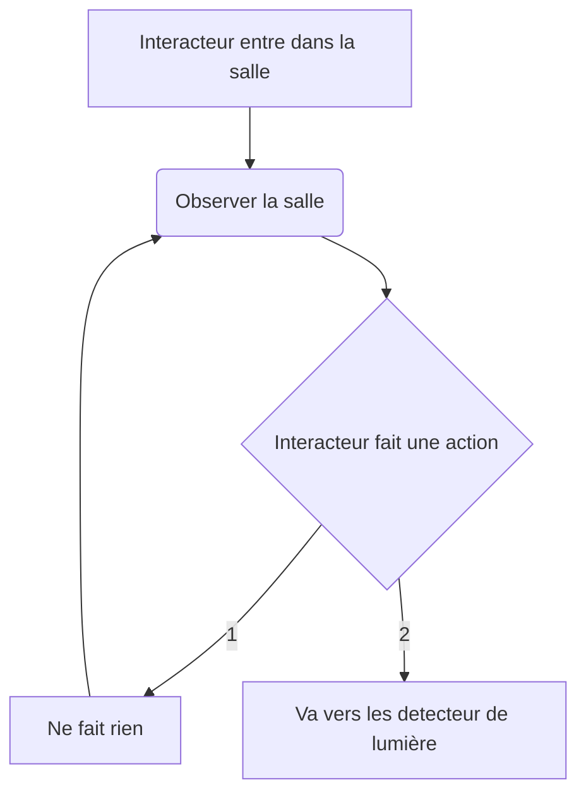

# Scénarisation

## Idée

### Concept

Installation qui utilise l'ombre de l'interacteur pour affecter une projection circulaire.

### Objectifs

Créé un lien entre l'interacteur et le visuel.

### Motivations

* Une bonne compréension de touchDesigner
* Permet un element d'intercativiter simple

## Scénario

## Ambiance

### Planche d'ambiances visuelles (moodboard)

### Planche d'ambiances sonores

### Références artistiques (image de reference)

## Technologies

### Support médiatique

### Matériel

### Logiciels
