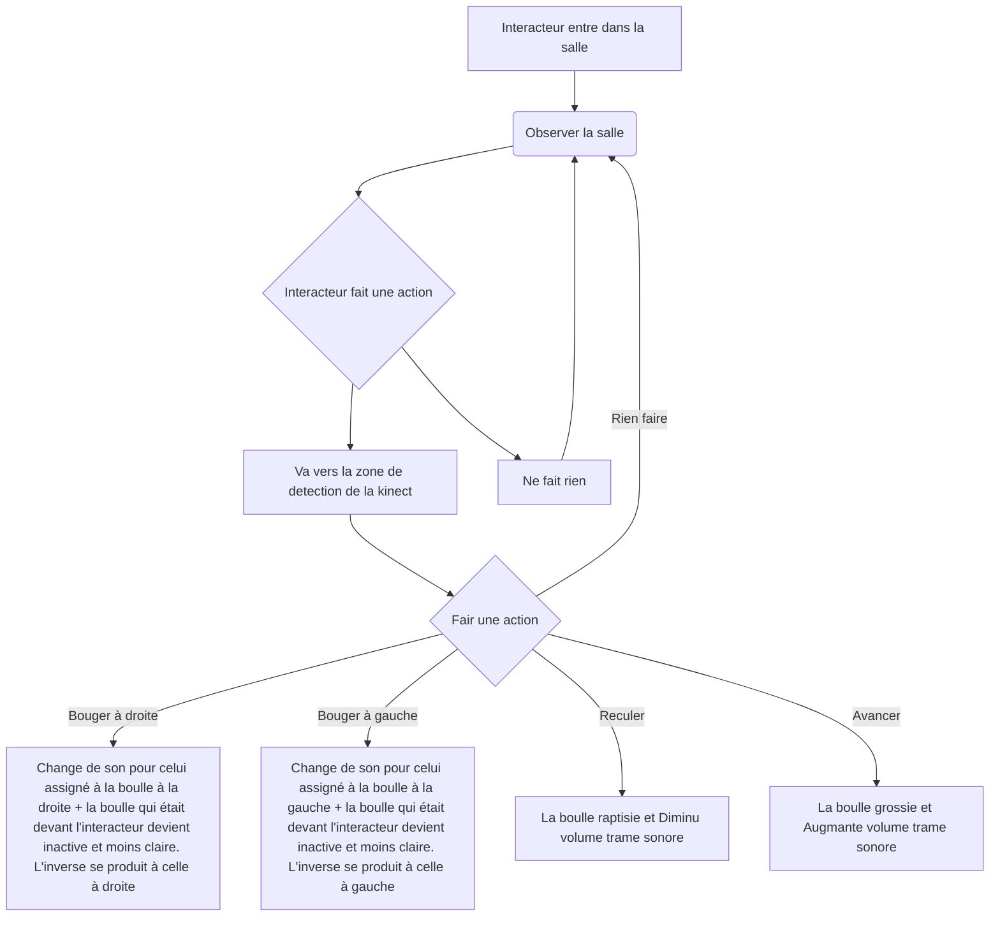

# Projet : Le piano d'étoile

## Idée

### Concept

Installation qui utilise une kinect pour detecter la postion de l'interacteur pour effectuer une projection.

### Objectifs

Créé un lien entre l'interacteur et le visuel. Permetre de voir la grandeur des astres qui entoure la terre.

[Définition des objectifs de l'expérience : quel est le message ou l'émotion que l’on souhaite faire passer ?]: #

### Motivations

[Discussion des motivations créatives derrière le choix des médias et des technologies.]: #

* Une bonne compréension de touchDesigner

## Scénario

## Ambiance

### Planche d'ambiances visuelles (moodboard)

### Planche d'ambiances sonores

[Vidéo Youtube son d'étoile (les crédits des sons son dans la description de la vidéo)](https://www.youtube.com/watch?v=UoIm7IS0sgY)

[Utilisation d'échantillons, de musiques, de textures sonores pour représenter l’univers artistique.]: #

## Technologies

### Support médiatique

Utilisation de sons différents pour chaque section où il y aura une boulle dans la projection pour créer une trame sonore complète.
Visuel fait avec TouchDesigner créant des images de boulles chantantes ressemblant à des étoiles.

[Description des types de médias (vidéo, audio, lumières, capteurs, etc.) et de leur intégration pour créer une expérience immersive.]: #

### Matériel

#### Schéma

Le point est l'interacteur.

* Projecteur

* Lumières (x3)

* kinect (x1)

* Speakers (x2)

* Mur

* Cables (extensions, cables pour la kinect)

* Portable ou ordinateur avec touchDesigner

* Écran, souris et clavier

### Logiciels

* TouchDesigner

* OSCBridge (pour le moment)

* Programme Arduino

### Réseautage

Communication faite entre un portable ou un ordinateur avec un périphérique qui a un programme Arduino qui permet la communication avec TouchDesigner.
Câble USB ou Ethernet à déterminer.

## Réferences

### Medias

* [The Immersive, Transcendental Experience of AudioVisual Installation](https://medium.com/@harrydavidhm/the-immersive-transcendental-experience-of-audiovisual-installation-b252b76d860c)
* [Générer par ai trouver sur google](https://www.freepik.com/premium-ai-image/multimedia-installation-exploring-role-design_235406780.htm)
* [‘We Harvest Wind’ Renewable energy art installation](https://www.youtube.com/watch?app=desktop&v=tzfy7VtPCCU)
* [Connection 1](https://blog.connectinstitute.ma/connexion-1-une-installation-multimedia-unique/)
* [Boulle rgb](https://www.youtube.com/watch?app=desktop&v=DKmHAMbtDlg)

**Par Victor Gileau**
