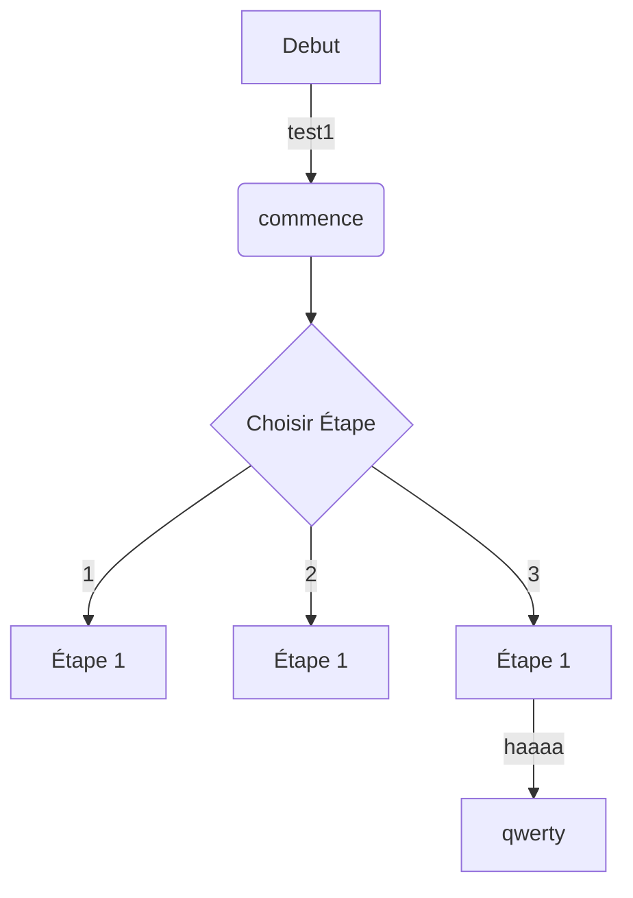

# Scénarisation

## Idée

### Concept

### Objectifs

### Motivations

## Scénario

## Ambiance

### Planche d'ambiances visuelles (moodboard)

### Planche d'ambiances sonores

### Références artistiques (image de reference)

## Technologies

### Support médiatique

### Matériel

### Logiciels
